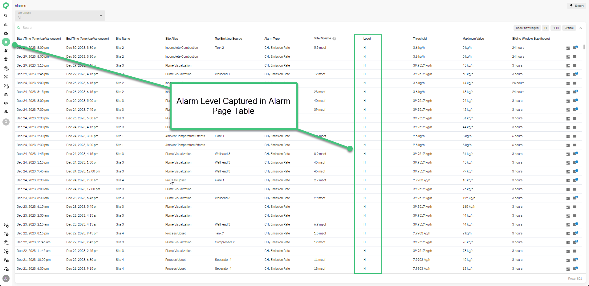

# Releases 2.33 - 2.37

Highlighted Feature: Alarm Levels & Rate-Based Alarms

<!-- truncate -->

## What's New

- **New Methane Emission Alarm Levels:** Methane alarms are now
  rate-based (kg/h) with three severity levels: Hi, Hi-Hi, and Critical.

**How to Use:**

1.  **Viewing Alarms:**

    - Check the alarms table on the site dashboard for alarm levels,
      indicated by colors: Hi (Yellow), Hi-Hi (Orange), Critical (Red).

    - For detailed alarm information, visit the Alarms page and look
      under the Level column.

**Benefits:**

- **Precise Monitoring:** Tailor your response to varying emission
  levels, improving operational control.

- **Enhanced Workflow:** Customize workflows based on alarm severity.

**Note:** Custom notifications for alarm levels will be available in
early Q3. For assistance, contact your Qube sales or customer success
representative.

### Other New Features

1.  **New Energy Units:**

    - Methane data can now be shown in Gigajoules (GJ/GJ/d) or Million
      British Thermal Units (MMBtu/MMBtu/d).

2.  **Enhanced Basemap Compatibility:**

    - Now support uploading TIFF, KMZ, and KML files for site basemaps.

3.  **Detailed Site Attributes:**

    - Includes Business Unit, Asset/Area, Country, State/Province,
      Regulations, Site Types, Basin and Fluid Type.

4.  **Date Picker Enhancements:**

    - Can quick select options for standard time periods (weeks, months,
      etc.) or select a full Week or Month using arrows or title on the
      detailed calendar view.

### Key Features Coming Soon

1.  **Alarm Workflow & Classification**

    - Enhance Alarm Response by assigning classifications and
      identifying root causes within the platform.

2.  **AVO and Flyover Inspections**

    - Integrated Inspection Management for logging AVO inspections and
      uploading third-party flyover inspections into the platform.