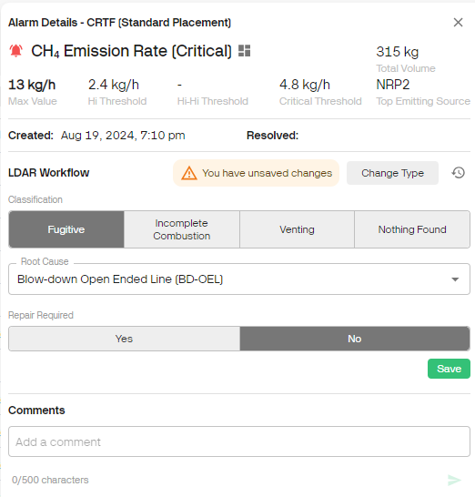

# Release 2.39

Workflows, Emission Classification

<!-- truncate -->

## What's New

- **LDAR Workflow**: Manage your CH4 Emission Rate Alarms with the
  built-in LDAR Workflow. Classify related emissions, assign a Root
  Cause and track Repair Status right in the Qube Dashboard. You can
  opt-out by modifying your Alarm Parameters to trigger the Basic
  Workflow instead.

- **Basic Workflow**: For other alarms, the Basic Workflow simply lets
  you add a comment and mark Alarms as "Resolved" so you can track the
  close-out and status of all your alarms from one place.

- **Emission Classification**: On the Site Dashboard, click any emission
  event in the Timeline to classify. All classification data is
  available as options within Emission Trends, and in CSV exports.

## What's Coming?

- **Rolling Averages**: See your emission rates as rolling averages to
  get a better picture of your emissions profile over longer time
  periods.

- **Baselines and Site Status**: Calculate a site's "baseline" emission
  levels right in the dashboard and keep track of site performance
  against that baseline.

- **AVO and Flyover Inspections:** Integrated inspection management for
  logging AVO inspections and uploading third-party flyover inspections
  into the platform.

## Other News

- Qube is now SOC Type 2 Certified! You can rest assured that your data
  is safe with us!

- If you haven't read it yet, we highly recommend checking out our most
  recent blog post:

  - [Why Probability of Detection (PoD) is a Flawed Metric for
    Evaluating Continuous Monitoring Systems --- Emissions Reduction
    Through Continuous Monitoring
    (qubeiot.com)](https://www.qubeiot.com/resources-news/why-probability-of-detection-is-a-flawed-metric-for-evaluating-continuous-monitoring-systems)

For more information on how to use these new features, please reach out
to your Qube Customer Success Manager.
