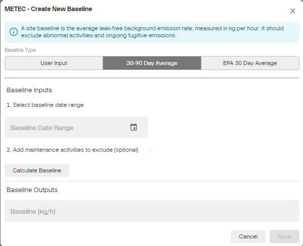
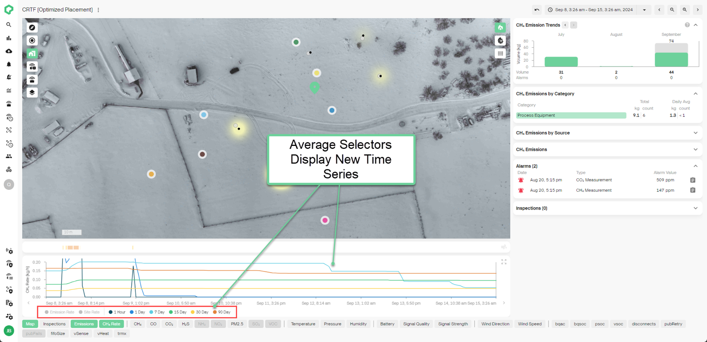

# Release 2.40

Site Baselines, Emission Rate Rolling Averages

<!-- truncate -->

## What's New

- **Site Baselines:** Improve your monitoring and managing of emissions
  using the Site Baselines Feature! Calculate your site\'s baseline
  using a yearly inventory, a 30 to 90-day average, or an EPA-compliant
  30-day average. Set a specific baselining period that complies with
  EPA OOOOb/c. Easily spot over-emitting sites by comparing emissions
  against their baseline on the Emission Trends page or Site Dashboard.

- **Emission Rate Rolling Averages**: Get a clearer view of your
  emissions profile over time with the new Emission Rate Rolling Average
  selector on the Site Dashboard. Choose from 1-hour, 1/7/15/30/90-day
  rolling averages, alongside the existing site and emission rate
  series, to monitor your site's emission rates more effectively.

> 

## What's Coming?

- **Site Status**: Track and visualize site performance relative to
  baseline on the overpage and site dashboard.

- **AVO and Flyover Inspections:** Integrated inspection management for
  logging AVO inspections and uploading third-party flyover inspections
  into the platform.

## Other News

- Qube is now SOC Type 2 Certified! You can rest assured that your data
  is safe with us!

- If you have not read it yet, we highly recommend checking out our most
  recent blog post:

  - [Interrogating Emissions Using the Qube Platform
    (qubeiot.com)](https://www.qubeiot.com/resources-news/interrogating-emissions-using-the-qube-platform)

For more information on how to use these new features, please reach out
to your Qube Customer Success Manager.
