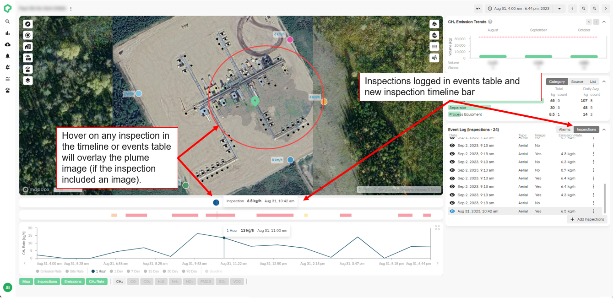
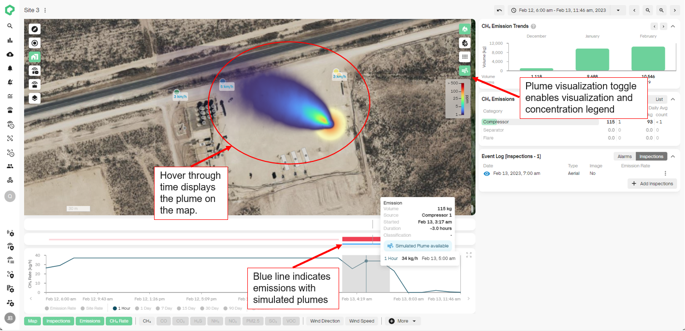

# Release 2.41

Aerial Inspections, Emission Plumes

<!-- truncate -->

## What's New

- **Aerial Inspections:** Upload and document your flyover inspections
  directly to the Qube Platform! View your inspection and Qube results
  directly on the site map or on the emission timeline for real time
  comparison in one platform. Increase your confidence in determining
  emission rates and durations by storing and comparing all your
  emission monitoring data in one location!

- **Emission Plumes:** Generate and visualize simulated plumes for your
  emission events. Overlay simulated plumes with your flyover
  inspections for direct comparisons to gain greater transparency and
  understanding of the Qube quantification and localization model
  through visualization!

## What's Coming?

- **Site Status**: Track and visualize site performance relative to
  baseline on the overpage and site dashboard.

- **EPA 7-Day and 90-Day Action Level Exceedance Alarms:** Track and
  alert on EPA 7-day and 90-day rolling averages and action level
  exceedances for your EPA regulated sites.

## Other News

- Qube is now SOC Type 2 Certified! You can rest assured that your data
  is safe with us!

- If you have not read it yet, we highly recommend checking out our most
  recent blog post:

  - [Interrogating Emissions Using the Qube Platform
    (qubeiot.com)](https://www.qubeiot.com/resources-news/interrogating-emissions-using-the-qube-platform)

For more information on how to use these new features, please reach out
to your Qube Customer Success Manager.
