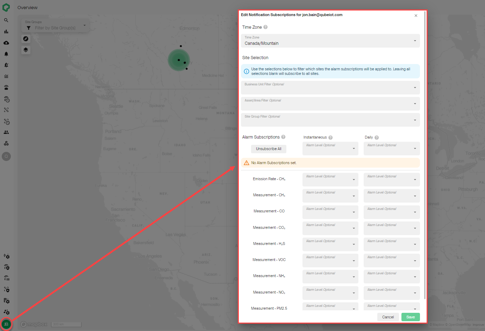
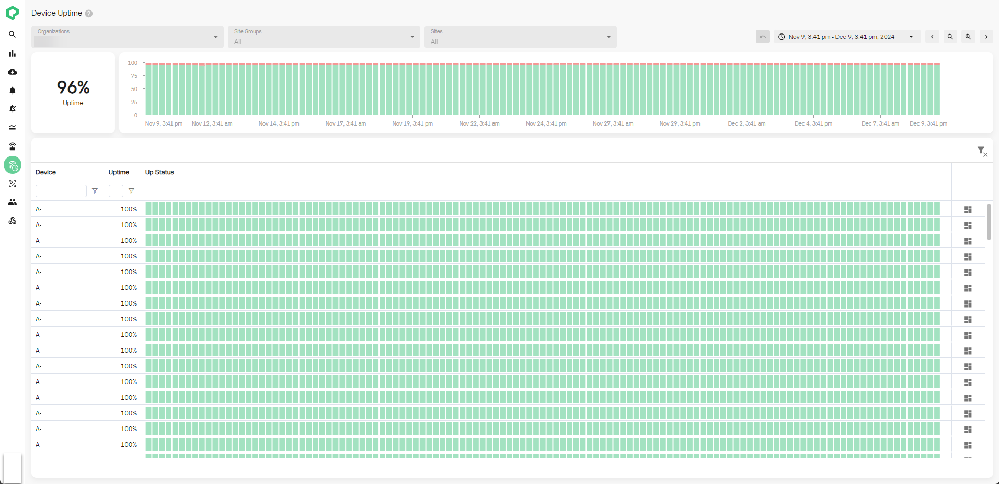
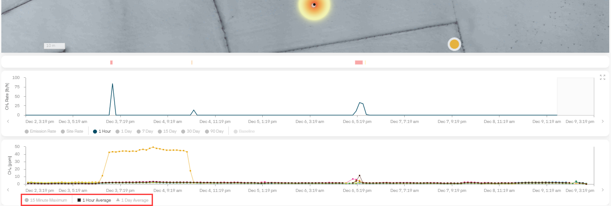

# Release 2.43

Customizable Alarm Notifications, Device Uptime, Concentration Averages

<!-- truncate -->

## What's New

- **Customize Alarm Notifications by Level**: You can now personalize
  alarm notifications for specific alarm parameters and levels. Choose
  which parameters to monitor, select the alarm levels and notification
  frequency (daily or instant). Update your preferences in the alarm
  notification settings.

- **Track Device Uptime Across Your Organization (Admin Only):**
  Organization admins can now review Qube device uptime over time.
  Uptime is calculated for each device at 6-hour intervals and is rolled
  up into a fleetwide uptime score as a percentage of time. Track uptime
  over time at the device, site, or the organization level!

- **View Gas Concentration Averages Over Time:** You can now toggle
  between hourly and daily averages for your gas concentration time
  series charts. Filter out short-term noise and peaks to identify broad
  term trends over time. Toggles can be found at the bottom of any
  measurement-based time series.

