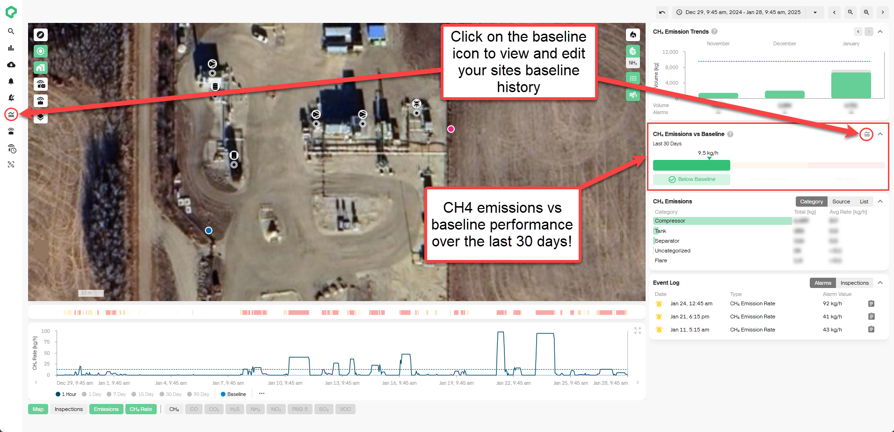
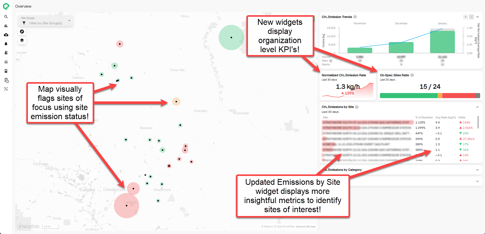
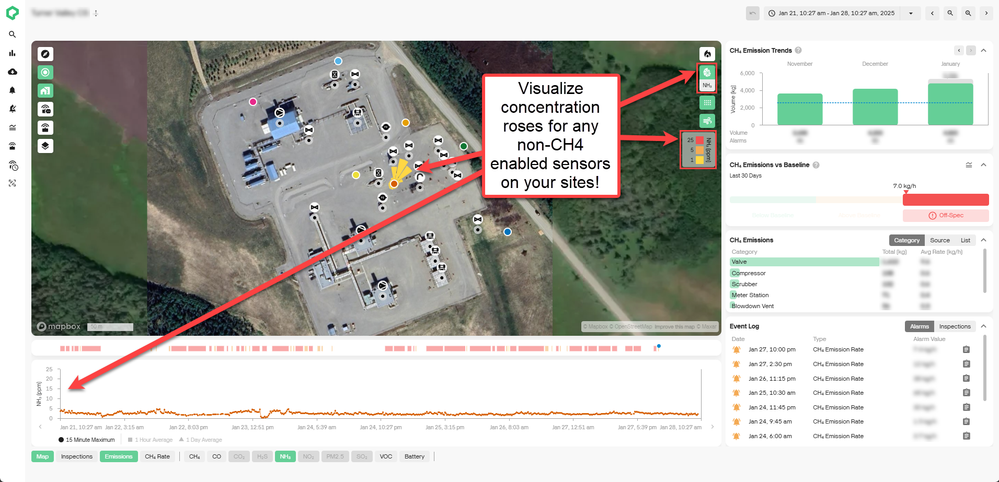
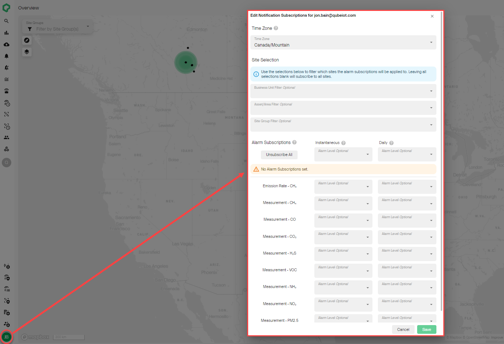
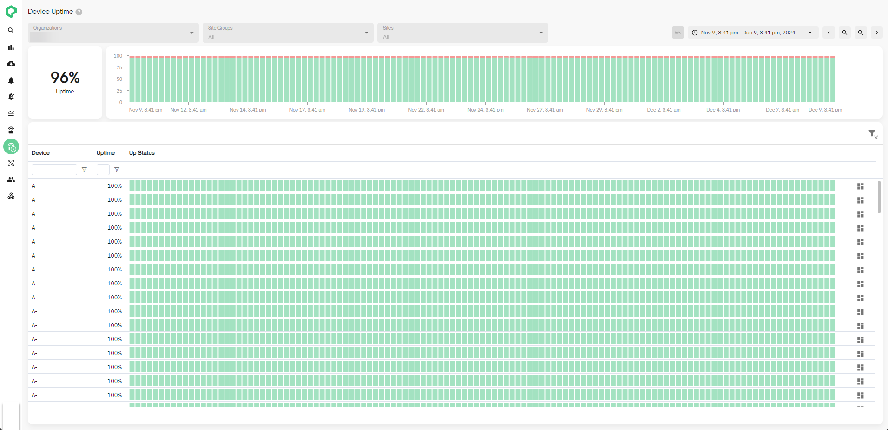
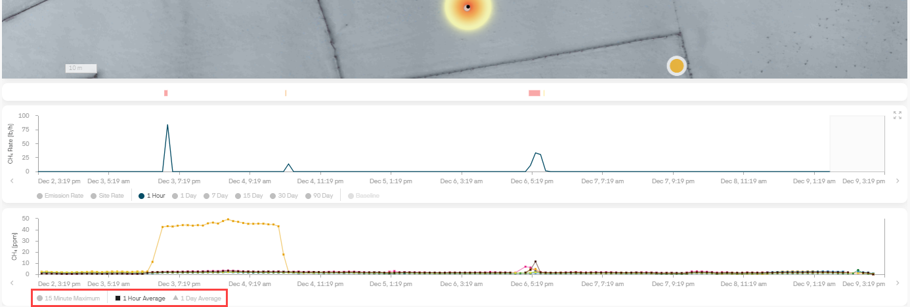

# Release 2.45

Site Emission Status, Baseline Editing & Deleting, Non-CH4 Concentration Roses

<!-- truncate -->

## What's New

- **Site CH4 Emission Status**: We now track and visualize your site
  CH4 emissions relative to baseline across your organization! A site
  is classified as either below baseline, above baseline or off-spec
  over the last 30 days. Site emission status is visualized on the site
  and overview dashboards to provide greater visual indications of sites
  requiring attention. To enable this feature, all you need to do is set
  a baseline for your sites!

- **Baseline Editing & Deleting:** To provide greater flexibility in
  setting your sites baselines, we've enabled editing and deleting. You
  can now edit the **Effective To** and **Effective From** dates for any
  baseline. You can also delete and add historic baselines as required
  to ensure your site baseline over time matches reality! Simply
  navigate to the baseline history modal on the baselines page or from
  the new CH4 emissions vs Baseline modal on the site dashboard to
  create, edit or delete!

- **Non-CH4 Concentration Roses:** You can now visualize non-CH4 gases
  concentration roses on the site dashboard map. This will provide you
  with greater troubleshooting insights into non-CH4 gas transport and
  severities around your site.

- **Track Device Uptime Across Your Organization (Admin Only):**
  Organization admins can now review Qube device uptime over time.
  Uptime is calculated for each device at 6-hour intervals and is rolled
  up into a fleetwide uptime score as a percentage of time. Track uptime
  over time at the device, site, or the organization level!

- **View Gas Concentration Averages Over Time:** You can now toggle
  between hourly and daily averages for your gas concentration time
  series charts. Filter out short-term noise and peaks to identify broad
  term trends over time. Toggles can be found at the bottom of any
  measurement-based time series.

