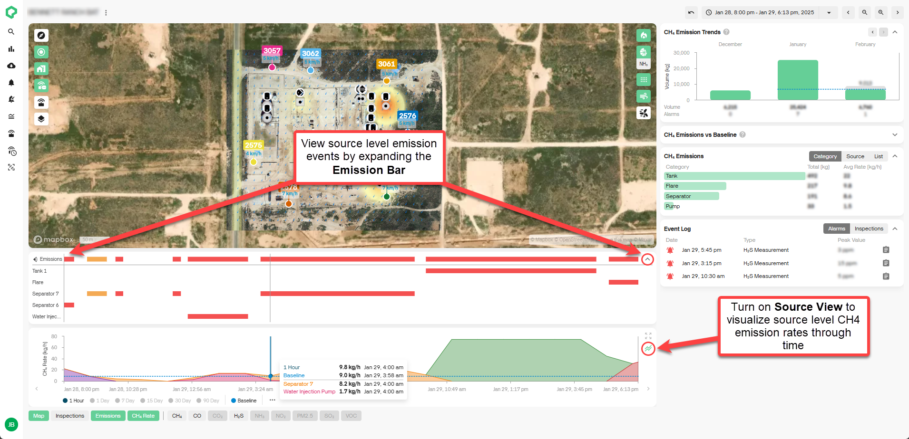
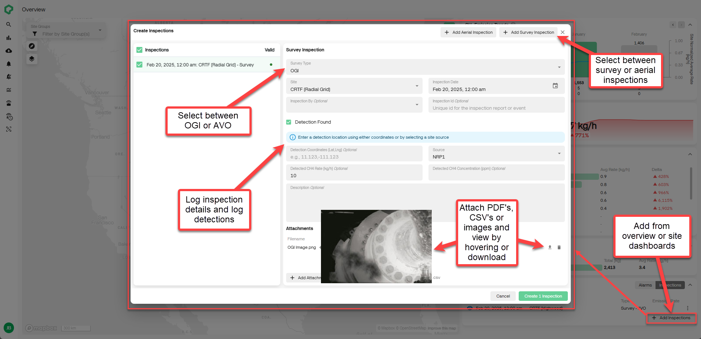
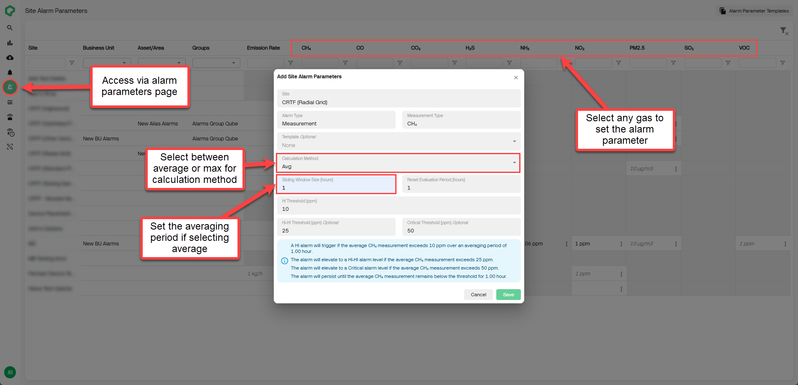
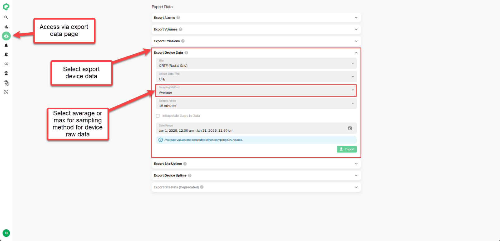

# Release 2.46

Source Level Emissions, AVO & OGI Inspections, Average Measurement-Based Alarms & Average Device Data Exports

<!-- truncate -->

## What's New

**Source Level Emissions & Emission Rate Visualization**

Take control of your site's emission data with new visualization
capabilities designed to provide a clearer, more detailed view of source
level emission rates. These enhancements include:

- The new **Source View** on the CH~4~ Rate, which enables a more
  precise analysis of source-level emission trends through time.

- Expanded **Emission Bar** functionality, allowing users to refine
  emission tracking to the source level.

*How this helps:* Greater visibility into source level emissions,
supporting more targeted mitigation efforts and improved compliance
reporting.

**AVO & OGI Inspections**

The platform now supports the ability to log and store survey-based
inspections directly in the Qube platform with the new **Survey Type**
inspection feature. Users can select from **AVO (Audio, Visual, and
Olfactory) or OGI (Optical Gas Imaging) inspection types**, add
inspection findings, and attach **PDF, CSV, or image files** for
streamlined record-keeping and compliance tracking.

*How this helps:* Simplifies regulatory compliance by centralizing all
leak detection and repair (LDAR) records in the platform, reducing
administrative burden and improving historical data tracking.

**Average Measurement-Based Alarms**

Create measurement level alarms based on average concentration data over
time! When setting your alarm parameter, select **"Average"** instead of
**"Max"** as the calculation method and define a desired averaging
period (sliding window) to trigger alerts based on sustained
concentration readings rather than single concentration spikes.

*How this helps:* Greater flexibility in alarm configuration, tailoring
measurement-based alarms to your operational needs.

**Average Device Data Exports**

Export average device data directly from the platform. By navigating to
the export data page, select **"Export Device Data",** select
**"Average"** as the sampling method, and select from a sampling period
of either 15 minutes, 1 hour or 1 day to generate reports with averaged
measurements.

*How this helps:* Expands options for data exports, extracting the same
averaged data displayed on the platform for offline analysis and
integration into your external systems.

