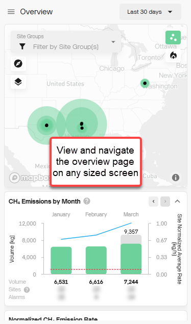
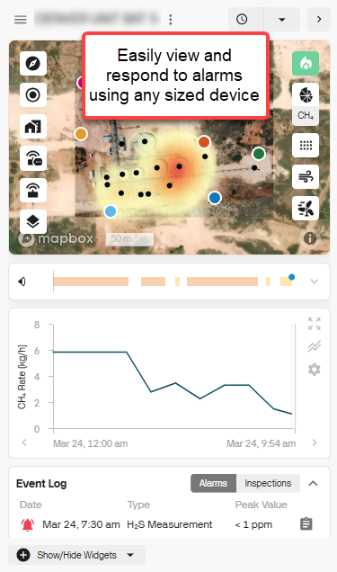
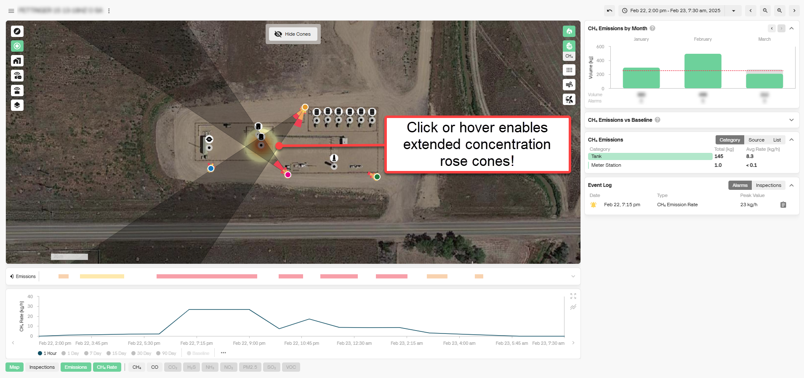
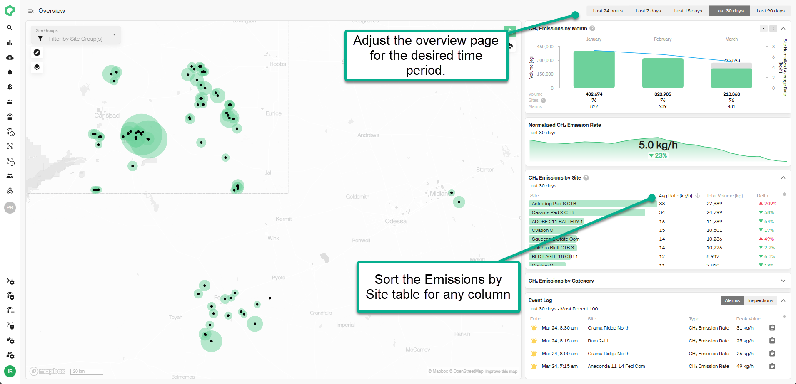

# Release 2.47

Enhanced Mobile UI, Interactive Concentration Roses, & Overview Page Enhancements

<!-- truncate -->

## What's New

- **Enhance Mobile User Interface**: Access and navigate your emissions
  data from any device.\
  Our redesigned, mobile-friendly interface ensures a smooth experience
  across all screen sizes. Whether you\'re in the field or at your desk,
  you can quickly respond to site-level alarms. Just click the link in
  any Qube alarm email to be taken directly to the relevant site
  details.

 

- **Interactive Concentration Roses:** Quickly pinpoint probable
  emission sources with our new interactive concentration roses! Easily
  extend rose cones by hovering for a preview or clicking to lock them
  in place. This enhanced visualization helps you better analyze
  potential sources over a given time, making emissions tracking more
  intuitive and actionable.

- **Overview Page Enhancements:** Easily find sites of interest with new
  sorting and filtering options on the Overview page. Quickly adjust the
  time range (last 24 hours, 7 days, 15 days, 30 days, or 90 days) and
  sort the CH₄ Emissions by Site table by any column to identify key
  trends and priority sites at a glance.

