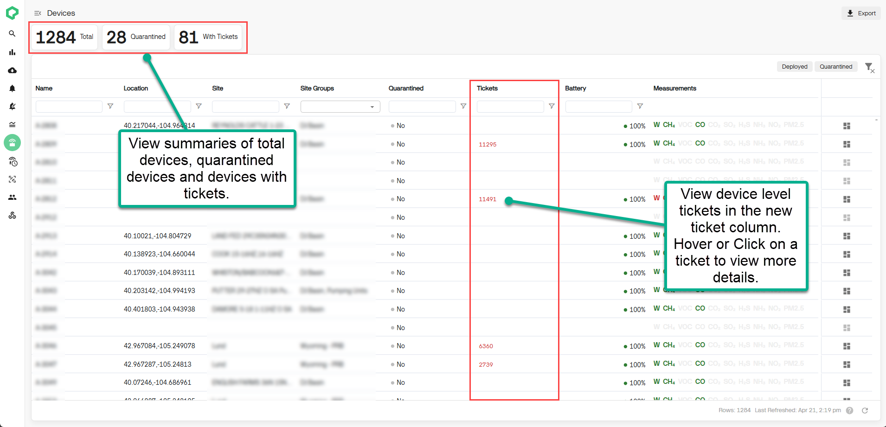
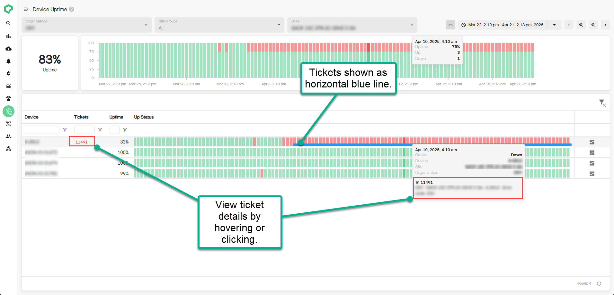
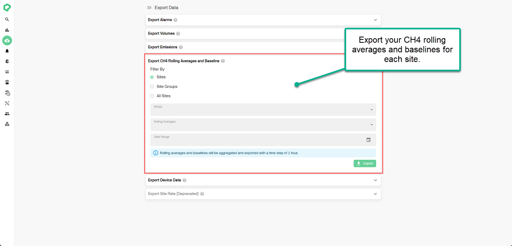
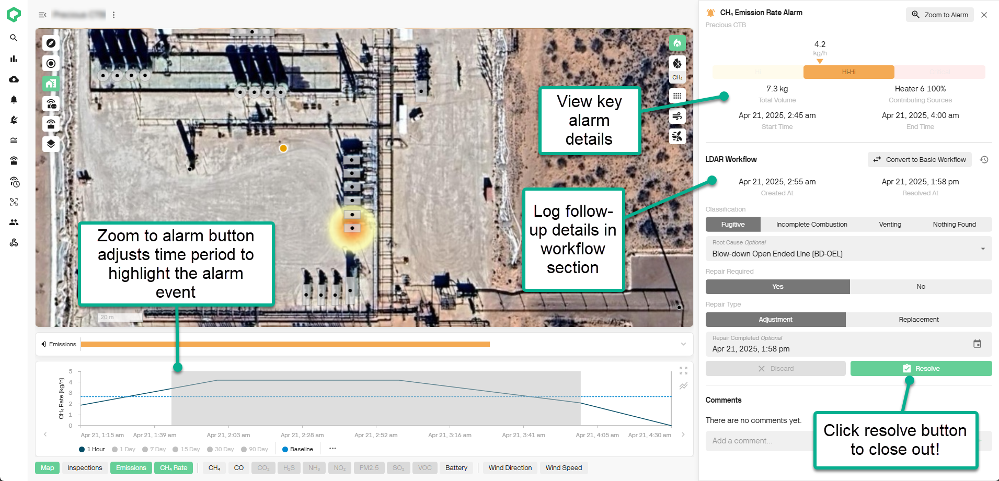

# Release 2.48

Support Ticket Tracking, Rolling Average Exports, Alarms UI & UX Improvements

<!-- truncate -->

## What's New

- **Better visibility into device performance and support tickets**

  - Admins can now track and monitor Qube support tickets for their full
    fleet of Qube devices on both the devices and uptime pages.
    Individual ticket details can be viewed by hovering or clicking on
    individual ticket numbers.

- Tailor your data exports, process data before exporting.

- **Rolling Averages Export:** You can now export the CH4 rolling
  averages and site baselines plotted in the CH4 Rate charts on the site
  dashboards.

- **Improved user experience with alarm functionality, seamless,
visibility, easier navigation**

- **Alarms UI/UX Improvements:** Quickly identify alarm criticality,
thresholds and sources with our updated alarm slide-out user interface.
Easily navigate to the alarm event using the "Zoom to Alarm" button and
effortlessly log follow-up details from the field using the updated
workflow section. Make sure to hit the "resolve" button to mark the
alarm as complete (green)!

