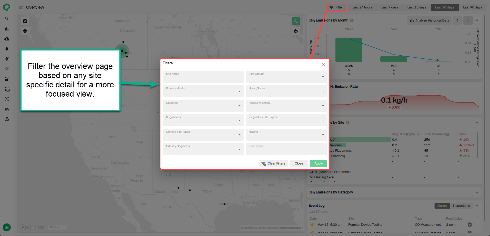
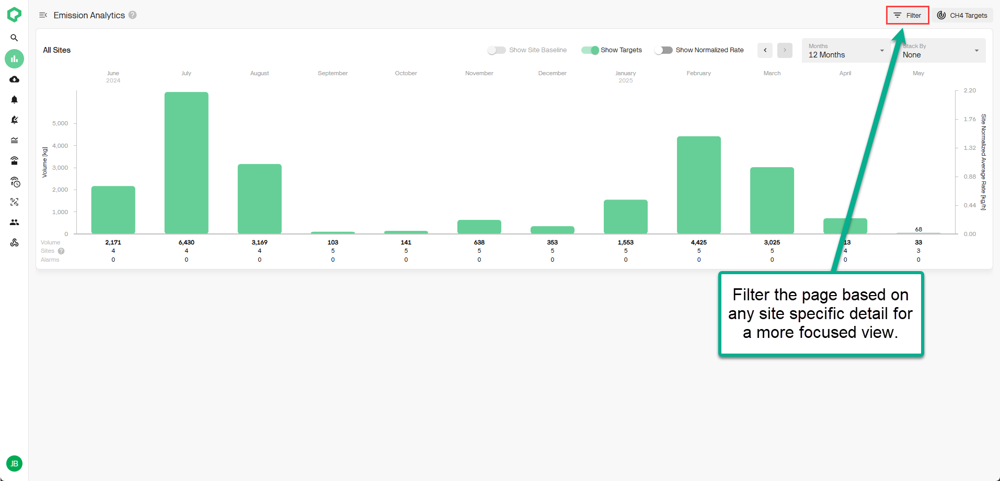

# Release 2.49

Improved Overview Page Filtering, New Emission Analytics

<!-- truncate -->

## What's New

### Improved Overview Dashboard Filtering

  - Users can now filter the **Overview** dashboard using any **site detail**
    (e.g., business unit, area, regulation, site group, etc.). These
    same flexible filters are also available on the new **Emissions
    Analytics** dashboard, enabling a more tailored and consistent analysis
    experience across the platform.

### NEW Emissions Analytics Dashboard

  - The Emissions Trends Dashboard has been renamed to **Emissions
    Analytics** and now features the updated filtering experience
    introduced on the Overview Dashboard. This update lays the foundation for
    upcoming enhancements, including new visualizations like site
    performance to support deeper historical analysis. **More
    improvements are on the way---stay tuned!**

