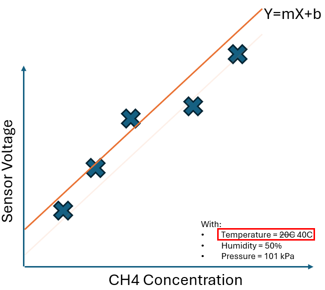

# Calibration

To achieve the highest possible accuracy, each Metal Oxide (MOX) sensor undergoes a calibration process to account for microscopic differences in the crystalline structure of the metal oxide surface that could lead to inconsistencies in the chemical reactions and resultant output.

Calibration consists of exposing each sensor to known methane concentrations in a controlled environment and recording the corresponding voltage drop. This data forms the "calibration curve," which relates voltage output to methane concentration.

## CH4 Concentration

Below is an extremely simplified example. The true calibration curve is represented by a complex combination of polynomials and exponentials, but let's consider a calibration curve that is just a simple line. We will adjust a single variable: *CH4 concentration*, and monitor the resultant voltage:

The above calibration curve could be represented by the formula: Y = mX + b, where the **calibration coefficients** used to describe the shape of the *curve* in this case would be **m** (the slope) and **b** (the intercept).

## Environmental Conditions

This simplified example becomes slightly complicated by the fact that the output voltage is also sensitive to environmental variables like temperature, humidity, and air pressure. Let's adjust temperature an re-run the calibration using our simplified example:

By changing this single environmental variable, then re-running the calibration with varied CH4 concentrations, we can build another calibration curve, represented by a different formula.

Another way to look at it, is that we have mapped another 2-dimensional *slice* of a 3-dimensional *calibration surface*. That surface represents output voltage corresponding to every combination of temperature and CH4 concentration:

By changing temperature independently, then calibrating at different CH4 concentration values, we were able to map a new region of the problem space, transforming the simple 2-dimensional curve (voltage vs. concentration) into a 3-dimensional surface (voltage vs. concentration vs. temperature).

What happens when we alter the other environmental conditions like humidity and pressure independently? In the same way that we moved from a 2-dimensional slice of a 3-dimensional surface, the same relationship holds in higher dimensions: the 3-dimensional surface is just a slice of a higher dimensional surface, turning this problem into an *n-dimensional* surface described by a complex mathematical formula using a long set of **calibration coefficients** unique to each sensor.

To map the full extent of the multidimensional surface accurately, the calibration process is repeated many times, varying both gas concentration and the environmental conditions all independently. This results in a unique set of calibration coefficients for each sensor which are applied and adjusted on the devices through our cloud IOT Platform, allowing accurate determination of methane concentration across a wide range of environmental conditions.

## Validation

Each sensor is lab calibrated to all expected ranges of operating conditions and gas concentrations, with an accuracy of 1 ppm or 1% of the reading, whichever is greater.

While the lab calibration procedure confirms the sensor’s response to highly controlled steady-state concentration values, this level of performance is periodically validated in the field, by measuring real plumes of methane at a controlled release test facility west of Calgary.

The field testing is intended to simulate an actual deployment and a typical emission profile a Qube device is expected to detect and measure. The sensors’ responses are compared against a high-quality reference, a Los Gatos Gas Analyzer (LGA), which is co-located during the test release campaign. The figure below shows an example of methane readings observed during a controlled release test with the two systems co-located:
