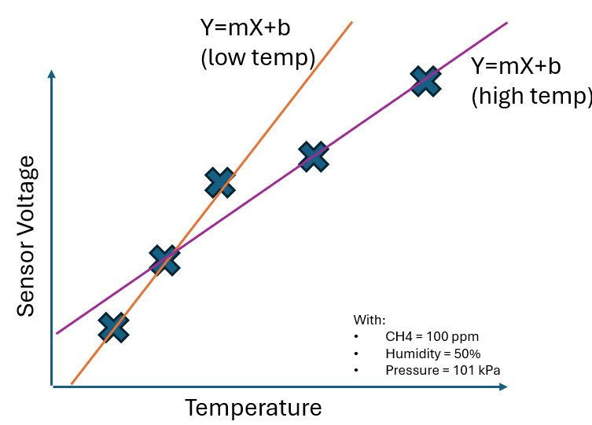

# High Temperature Sensors

The calibration curve and corresponding coefficients described previously are well suited to accurately map each sensor's voltage response to the varying conditions. However, it is worth noting that there are multiple curves and coefficients that could represent the problem space, and some may be better suited to different regions of the *calibration surface*.

Using the simplified example of a straight line, showing a slice of the multi-dimensional calibration surface, it is possible to see that two different *curves* could be used to map the calibration data correctly. While a line of best fit could be drawn to represent all the data, you would see increased error at the extreme ends of the curve.

One particular case where sensor error can approach levels that would exceed the tight specification imposed, is climates with prolonged periods of extremely high temperature and high humidity. When planning a deployment, local weather data can be used to determine if conditions with relative humidity exceeding 90% accompanied with temperature  above 40°C is a common occurrence. If so, an alternative set of calibration coefficients can be remotely deployed to these devices in order to increase accuracy for these operating conditions.

## Case Studies

To see some examples of Qube hardware operating in extreme environments, take a look at this set of case studies here:

* [Engineered for Extremes: How Qube’s Continuous Monitoring Devices Thrive in the Harshest Conditions](https://www.qubeiot.com/expert-insights/engineered-for-extremes)