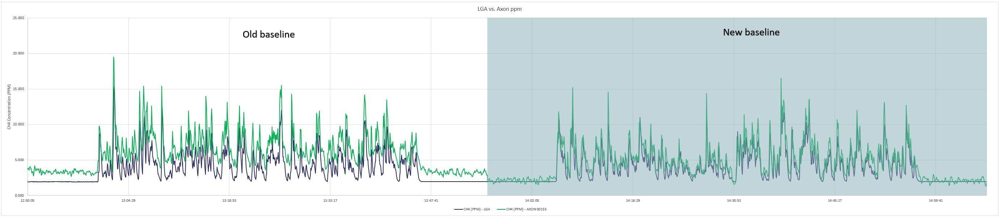
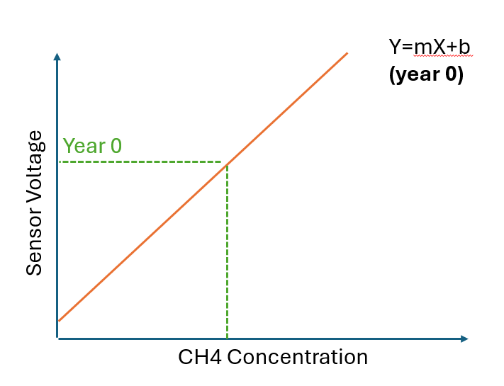
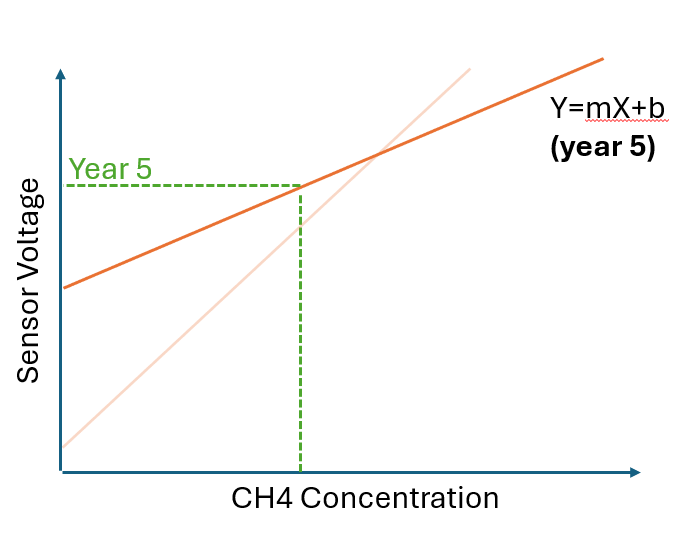
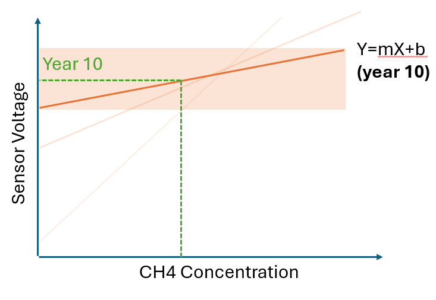

# Drift 

Metal oxide sensors, while sensitive and reliable, can experience **drift** as they age. This drift occurs when the sensor’s response to methane deviates from its original calibration curve due to environmental impacts on the metal oxide substrate over time. This can be due to microscopic changes to the surface area of the reaction surface as it cracks and moves, or due to poisoning of some reaction sites from contaminants. It is a known and well characterized behaviour that has made metal oxide usage in the continuous monitoring space a challenge.

Qube has developed a patent-pending auto-baselining algorithm to address the issue. The algorithm runs continuously in the background, detecting and compensating for drift without any human intervention. The algorithm identifies time periods when the air is clean and compares the sensor’s baseline response to the expected background methane level (typically the global average value of 1.9 ppm). If the detected baseline response deviates from this expected background level, the baselining procedure is initiated. If the algorithm determines that the sensor is not in clean air, then it waits for a period when the sensor is in clean air.

Baselining a device is essentially a form a field calibration or *zero-ing* that resets the devices to a known state, and revises a small subset of the calibration coefficients in a way that is known to maintain accuracy across the sensor's useable range.

## Baselining Example

The following figure shows real-world data from a Qube CH4 sensor that was deployed in the field for a little over 1 year. The data is superimposed with a co-located reference instrument (Los Gatos Analyzer) at Qube's Controlled Release Test Facility (CRTF). Measurements from the Qube sensor in green are shown to be elevated, until the automatic baseline routine identified the problem, and reset the coefficients to mitigate the drift.

## Response to aging

The true calibration curve is represented by a complex combination of polynomials and exponentials, but let's consider the simplified example curve again that is just a line.

At certain environmental conditions, a simplified version of the metal oxide sensor's calibration curve may look something like this:

As the sensor age and the reaction surface changes slightly at the microscopic level, we may see a response that has altered subtly:

## End-of-life

Adjusting the coefficients allows the sensor to maintain accuracy across its operating range as the sensor's chemical response to methane changes. This technique does have its limits however: as the curve changes, the baseline voltage being measured rises. While the altered curves maintain **accuracy**, it will map to a smaller *range* of voltages which effectively reduces the **precision** of the reading.

Seen visually with the simplified example of a straight line, this is analogous to the *curve* being flattened into a smaller region of measurable voltages.

While MOX sensors generally have a useful lifespan between 5 to 10 years, different sensors will age at different rates due to differences in their microscopic structures, the environmental conditions they are exposed to and the presence of contaminants, so it is important that we monitor the effects of aging across the fleet of devices.

Qube tracks sensor health using baseline voltage, along with other response metrics. If the baseline voltage gets high enough that precision is reduced beyond specification, the sensor can be replaced. Qube devices are built to be modular and the swapping a MOX sensor is a low-cost operation that can be readily performed in the field to preserve the device's overall lifespan.

## Validation

The patent-pending baseline algorithm and monitoring techniques have been validated with lab and field testing. The process and results are described in this whitepaper:

[**Long-Term Accuracy of Qube's Methane Sensor Calibration: A Two-Year Study** (pdf, 1.8 MB)](/pdf/Long-Term_Accuracy_of_Qube’s_Methane_Sensor_Calibration_A_Two-Year_Study.pdf)

### Whitepaper Summary

* Qube's metal oxide (MOx) sensors maintain consistent calibration and performance throughout a two-year operational period, demonstrating accuracy within 1 PPM for methane detection in industrial environments.
* The company's patent-pending auto-baselining algorithm successfully compensates for sensor drift without human intervention, automatically adjusting to environmental changes and sensor aging to maintain accuracy.
* Lab testing of 26 field-deployed sensors showed excellent accuracy, with error rates ranging from -7.64% to +1.36% across various methane concentrations (10-100 PPM), validating the robustness of the calibration process.
* The study confirms that Qube's platform enables cost-effective, large-scale deployment for industrial methane monitoring, with customers typically achieving 50-90% reduction in emissions through early detection and process improvements.