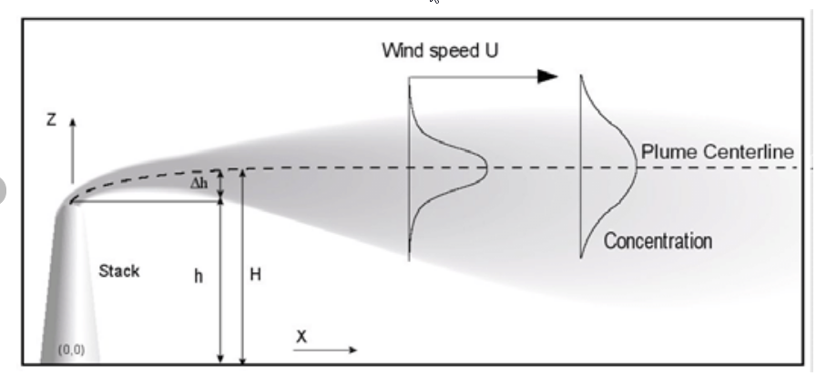

# Quantification

Once a leak source has been localized, the physics model can simulate a methane plume with the given methane readings, environmental conditions, atmospheric stability, and distance to the leak source to output an estimated leak rate.

